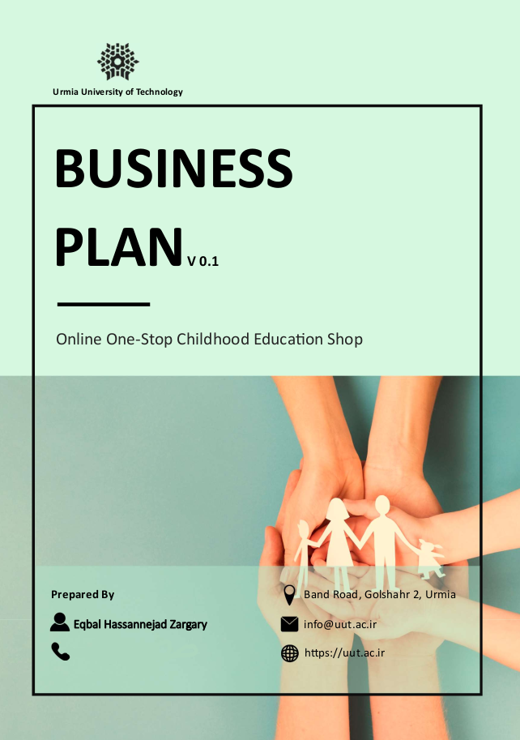

# Online One-Stop Childhood Education Shop Business Plan 

## Introduction

The following report is the result of three months of research and study in the field of children's education and the businesses currently active in this area. The aim of this research is to assist in the development of a business plan and to determine future strategies for a startup, paving the way for its entry into the children's education sector.

## Project Background

This project was conducted as part of my undergraduate studies at **Urmia University of Technology**. Upon the suggestion of my advisor, Dr. Ahmadi, co-founder of this startup, alongside Dr. Karimi, I assumed the responsibility of collaborating in drafting this plan as a temporary project manager. After initial agreements, it was decided that this collaboration in drafting the plan would be the subject of my undergraduate project.

Initially, the project title was **"Technical Development, Business Plan, and Software Design of a One-Stop Shop for Childhood Education"**. However, due to a high workload, lack of time, and shortage of human resources, it was decided, with the advisor’s full consent, to focus the main project on:
1. Market and competitor analysis
2. Identifying audience requirements
3. Providing suitable proposals and responses

This change allowed for a deeper and more comprehensive examination and analysis of various business aspects and the presentation of a complete and efficient initial plan. Ultimately, at the founders' request, I prepared the initial draft of the plan in English.

## Next Steps

With the information extracted from the results of this project and the strategies outlined in the initial plan, subsequent sections of this plan, including scheduling, operational plans, and cost calculations, will be completed, and the project will commence with a team of necessary specialists.

## Conclusion

It is hoped that this report will serve as a comprehensive and useful guide for executing this startup and as a reference for students and researchers interested in the field of children's education.

## Acknowledgments

Finally, I would like to sincerely thank my advisor, Dr. Ahmadi, for his invaluable guidance and necessary support. Undoubtedly, my collaboration in drafting this plan would not have been possible without his support and encouragement.

Additionally, although I did not have the opportunity to work directly with Dr. Karimi during the project, I extend my special thanks to him. His documentation and extensive studies greatly contributed to the drafting of this startup’s initial business plan.

## Contact Information

For inquiries or to request the full business plan, please email me at [e.hassannejad@protonmail.com](mailto:e.hassannejad@protonmail.com).
